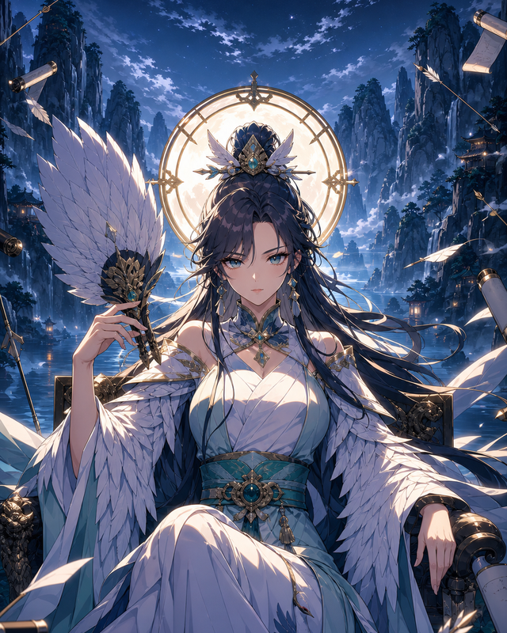
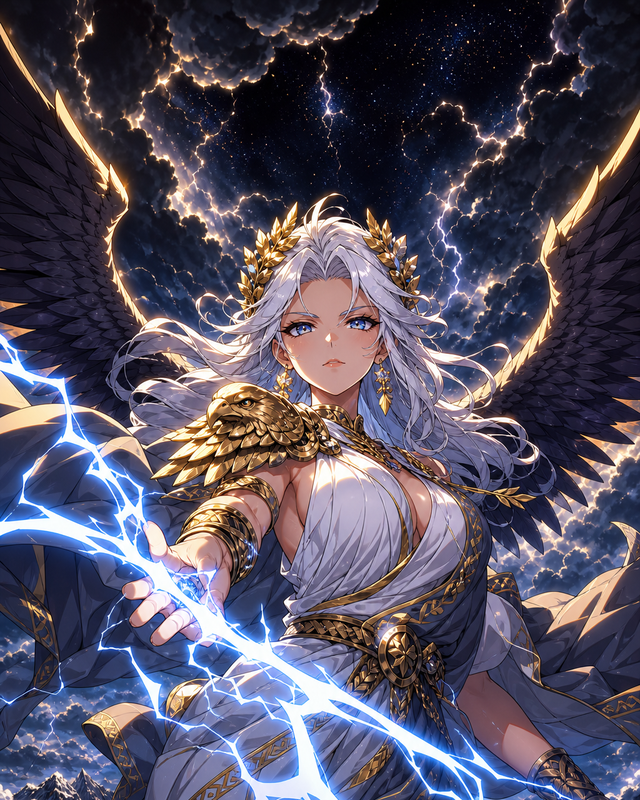
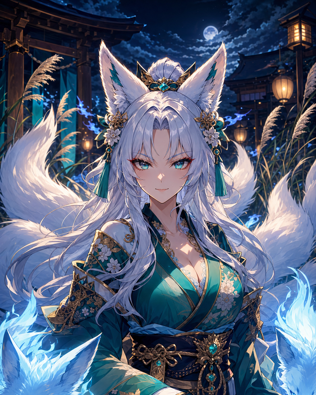

<!-- source-of-truth: package.json, src/config/rules.ts, src/data/cards/*.ts, src/data/starterDecks.ts, src/data/opponents.ts, src/scenes/, docs/design-system.md, docs/plan-design-system-alignment.md, docs/rules.md, docs/ai.md, docs/art-pipeline.md, docs/roadmap.md, docs/mobile-lan-plan.md, tests/ · last-verified: 2026-07-12
     If you change those files, update this doc or re-verify the date. -->

# Darling Blades

*A trading card game where the officers of the Three Kingdoms, the gods of Olympus, and a forest full of Beastkin all end up in the same 60-card deck.*

<p align="center">
  
  
  
</p>

<p align="center">
  <a href="https://vantaloomin.github.io/darling-blades/"><b>▶&nbsp; Play Darling Blades in your browser</b></a>
</p>

## What is Darling Blades?

Darling Blades is a single-player, Magic: the Gathering-style trading card game — five colors of mana, creatures and combat, instants and sorceries resolving off a stack, the whole 8th/9th/10th-edition rhythm of curving out and racing or grinding to a win. If you've played that era of Magic, you already know most of the rules.

What's different is the cast. Every card in the 210-card pool is a character drawn from three worlds sharing one card pool: the officers of **Wei**, **Wu**, **Shu**, and **Jin** from a (genderbent) Romance of the Three Kingdoms (plus an "Other" bench of warlords and wildcards — Dong Zhuo, Lü Bu, and company); the **Greek pantheon** of Olympus (Ares, Athena, Artemis, Hades, Persephone, Demeter, Hestia, and more); and tribal **Beastkin** — Wolfkin, Kitsune, Harpy, Bearkin, Rhinokin, Nekomata, Lamia, Spiderkin, Crowkin, Batkin, and others. The **Ragnarök** expansion adds a fourth world — a Norse graveyard faction of Valkyries, Norns, Jotun, Draugr, and the death-goddess Hel — for 69 more collectible cards. Every one of those cards, base pool and expansion alike, has finished, illustrated cel-shaded gacha-anime art — nothing in the shipped game is programmer-art or a placeholder.

You play or skip a short optional tutorial, claim a free starter deck, crack booster packs to build out your collection, assemble a 60-card deck in the deck builder, and duel an AI — either quick Practice matches at three difficulties, or the 12-rung **Avatar Gauntlet**, a ladder of named boss opponents each running their own themed deck.

## Features

- **A 210-card, fully illustrated base pool.** 200 of those cards are booster-eligible across five rarity tiers (103 Common / 65 Rare / 13 Super Rare / 11 Super-Super Rare / 8 Ultra Rare); the other 10 are five free, unlimited basic lands and five non-collectible tokens created by card effects. All five WUBRG colors are represented across the three casts. The **Ragnarök** expansion (set `ragnarok`, `rg-` prefix) adds 69 more collectible cards across the same five tiers, sold through its own set-scoped booster.
- **Five 60-card starter decks**, one two-color archetype per color pair — **Crimson Muster** (Red/White aggro), **Wild Communion** (Green/White creature tribal), **Burning Tides** (Blue/Red tempo-burn), **Shadow Mandate** (Blue/Black control), and **Grave Harvest** (Black/Green deathblade attrition) — every color shows up in exactly two of the five.
- **Real MTG-style deckbuilding rules**: 60-card minimum decks built from your own collection, up to 4 copies of any non-basic card (basics unlimited), 20 starting life, 7-card hands, a London-style mulligan with your first mulligan free, and an auto-tap mana solver so you're never manually tapping individual lands to pay generic costs.
- **Gacha-style booster packs** — 450 gold for 9 cards in the base booster, or 525 gold for 9 cards in the Ragnarök booster, with every slot independently rolling a rarity tier, a cosmetic frame (white/blue/red/gold/rainbow/black), and a holo finish (none/shiny/rainbow/pearlescent/fractal/void). The rarest possible pull — Ultra Rare, black frame, void holo — lands at roughly 1 in 4.94 million.
- **The Avatar Gauntlet** — a 12-rung ladder of named boss opponents (Meng Huo, Hestia, Lupa the Wolfqueen, Hera, Zhurong, Sima Yi, Yohime the Kitsune Matriarch, Cao Cao, the Ragnarök bosses Hel and Brunhild, and the Celtic Fae summit — The Morrigan and Titania, Queen of the Silver Court), each piloting a themed deck and personality at rising difficulty, with gold paid out per rung cleared plus a bonus for a full run. Just want one game? Practice mode runs the same three difficulties with no ladder attached.
- **Optional onboarding + long-term goals** — first launch offers a guided tutorial duel, and the Achievements screen tracks collection percentage, color completion, themed RoTK / Greek / Beastkin / Ragnarök goals, mono/dual-color tower clears, variant chase goals, mastery goals, and pack-opening milestones with claimable gold rewards.
- **Daily Blades** — three rotating daily quests with progress bars, claimable gold, and up to three rerolls a day, plus an escalating win-streak bonus paid on your first win of each calendar day. The same calendar day rolls the same quests for everyone (deterministically seeded, like everything else here).
- **Deck sharing and multiple saved decks** — keep as many constructed decks as you like (copy / rename / delete, plus a starrable per-deck hero card that fronts your in-duel portrait), and export any legal deck as a compact `DBD2-…` share code that another player can paste straight into their own Deck Builder — imports validate against their collection and the normal deckbuilding rules.
- **AI that never cheats.** Every difficulty — Easy, Medium, Hard — plays through the exact same redacted view of the game state a human opponent would see; none of them can look at your hand or either deck's remaining contents. Measured, not assumed: Medium beats Easy at least 80% of the time (measured ≈82.5%) and Hard beats Medium at least 70% of the time (measured ≈78%) across large seeded AI-vs-AI test batches.
- **Fully illustrated, nothing placeholder.** All 279 cards across the base pool and the Ragnarök expansion carry finished cel-shaded gacha-anime art plus eleven painted scene backdrops, paired with an entirely procedural audio layer — every sound effect and the four-mood generative ambient music score are synthesized live in the browser over WebAudio, with no audio asset files at all.
- **Built-in accessibility settings** — independent SFX and music toggles with volume control, an animation-level switch (full / reduced / off), a render-size selector (720p / 1080p / 1440p), and an auto-skip toggle that fast-forwards empty or forced duel phases. Every setting persists to your save.
- **Playable on your phone today.** The entire single-player loop runs comfortably by touch over your local network. Real head-to-head LAN multiplayer is designed but not yet built — see Project status below.

## How to play

The main menu routes to:

| Mode | What it does |
| --- | --- |
| **Avatar Gauntlet** | Climb the 12-rung ladder of named boss opponents; clear a rung and roll straight into the next, with per-rung gold and a completion bonus. |
| **Practice — Easy / Medium / Hard** | A one-off duel against the AI at your chosen difficulty, no ladder attached. |
| **Open Packs** | The shop: buy a 9-card booster (base or Ragnarök) and watch the rarity/frame/holo reveal animate slot by slot, or buy whole decks (the unpicked starters and the Ragnarök precon) from the Decks tab. |
| **Collection** | A binder-style spread of every card you own, filterable by color / type / rarity / owned, showing your best-owned print of each plus pool and special-variant completion progress. |
| **Deck Builder** | Build and edit your active 60-card deck from your owned collection. |
| **Achievements** | Review locked/unlocked/claimed goals and claim gold rewards for collection, variant, themed, mastery, and economy milestones. |
| **Card Showcase** | A gallery of every frame style × holo finish available on a given card. |

The main menu also hosts the **Daily Blades** quest panel and a read-only **Profile** page with your lifetime win-rate and gauntlet stats. On first launch you can play or skip the tutorial, then claim one free starter deck from the shop and receive a starting gold grant — enough for your first booster pack. The ⚙ Settings button opens the accessibility/audio options described above.

## Getting started

```bash
npm install
npm run dev      # Vite dev server at :5173
npm run build    # typecheck + production build
npx vitest run    # full test suite (~25-30s)
```

On Windows you can also double-click **`run-dev.bat`** or **`run-production.bat`** — both install dependencies if missing.

## Under the hood

Darling Blades is TypeScript on Vite, rendered with Phaser 3.90 (pinned — never v4), tested with Vitest, and linted with ESLint/typescript-eslint. There's no UI framework underneath the game view; it's Phaser end to end.

The codebase is split into two halves that never touch each other's concerns. `src/engine/` is a pure, Phaser-free, deterministic rules engine: given a set of decklists, a seed, and a sequence of player actions, it produces the exact same game state and event stream on every machine, every time — state is plain JSON, so a `structuredClone` is the entire "save/replay" story, and even the RNG lives inside that state as data. A single facade validates and applies every action and emits events; the Phaser scenes (`src/scenes/`) only ever consume that event stream to animate — they hold no rules logic of their own. The AI (`src/ai/`) plays through that same engine via the identical redacted view a human sees, which is what makes the "no AI reads hidden information" guarantee structural rather than a promise.

That separation is what makes a real test suite possible: **573 tests (3 skipped) across 59 files**, covering engine flow/combat/keywords/mana/RNG/determinism, the stack and effects, catalog integrity, meta systems (collection, economy, save migrations, gauntlet, achievements, daily quests, deck share codes, deck color identity), the variant/drop-distribution math behind the booster system, onboarding tutorial determinism, audio recipes and music patterns, platform/gesture/render-scale behavior, and AI smoke tests plus the win-rate gates above (hundreds of full AI-vs-AI games) — the whole suite finishes in about 25–30 seconds.

For deeper dives: [docs/architecture.md](docs/architecture.md) (layers, the event/decision model, determinism), [docs/design-system.md](docs/design-system.md) (visual language, tokens, components, and interaction contracts), [docs/plan-design-system-alignment.md](docs/plan-design-system-alignment.md) (the audited implementation sequence required for full alignment), [docs/rules.md](docs/rules.md) (the full ruleset as implemented), [docs/adding-cards.md](docs/adding-cards.md) (the card schema and how new cards get built), [docs/ai.md](docs/ai.md) (how each difficulty thinks), [docs/art-pipeline.md](docs/art-pipeline.md) (the art resolution and generation pipeline), and [docs/roadmap.md](docs/roadmap.md) (current status in detail).

## Project status

**Darling Blades is 1.0** (released 2026-07-10). The full solo loop (menu → optional tutorial → free starter claim → Avatar Gauntlet or Practice → daily quests and rewards → shop → pack opening → collection / achievements → deck builder) is wired end to end, every card in the pool has finished illustrated art, and the test suite is green.

**Shipped in 1.0:** the complete solo game loop; optional onboarding; daily quests and win streaks; achievements and collection-goal tracking with themed RoTK, Greek, Beastkin, Ragnarök, and tower-clear goals; deck share codes and multiple saved decks with per-deck hero cards; the 210-card base pool illustrated alongside the 69-card **Ragnarök** expansion (a Norse graveyard/reanimator faction, set `ragnarok`, `rg-` prefix, with its own set-scoped booster and a buyable precon); the five-tier rarity/frame/holo booster system; the full 5-color engine (mana, keywords, the stack, combat) plus Ragnarök's double-strike / mill / reanimate mechanics; three AI difficulties and 10 gauntlet personalities; procedural SFX and generative ambient music; a ground-up UI/theme refresh across every scene; the settings/accessibility menu; and phone-over-LAN play for the entire single-player loop.

**Coming after 1.0:** a **Limited mode** (Sealed and Bot Draft — already built and tested, releasing alongside a future expansion after more balance work), deterministic game replays, real-device touch/audio polish, and a by-ear/by-eye pass for music, SFX loudness, and holo/frame visuals. Real head-to-head LAN multiplayer is designed but remains further out.

## About this project

This is a personal, single-player project built and tuned by one developer — there's no multiplayer server and no public contribution pipeline at the moment. The codebase does hold itself to a few unusual disciplines for a solo project, though: the rules engine is fully headless and seeded-deterministic, every difficulty of AI is held to a measured (not assumed) win-rate floor, and the documentation in `docs/` carries anti-rot tooling (`npm run check-docs`) that flags a doc as stale the moment the code it describes changes without it.

## License

The source code in this repository is released under the [MIT License](LICENSE).

The illustrated card and scene art (everything under `public/assets/art/`) and the desktop app icons (`src-tauri/icons/`) are **not** covered by that license — all rights to those images are reserved.
