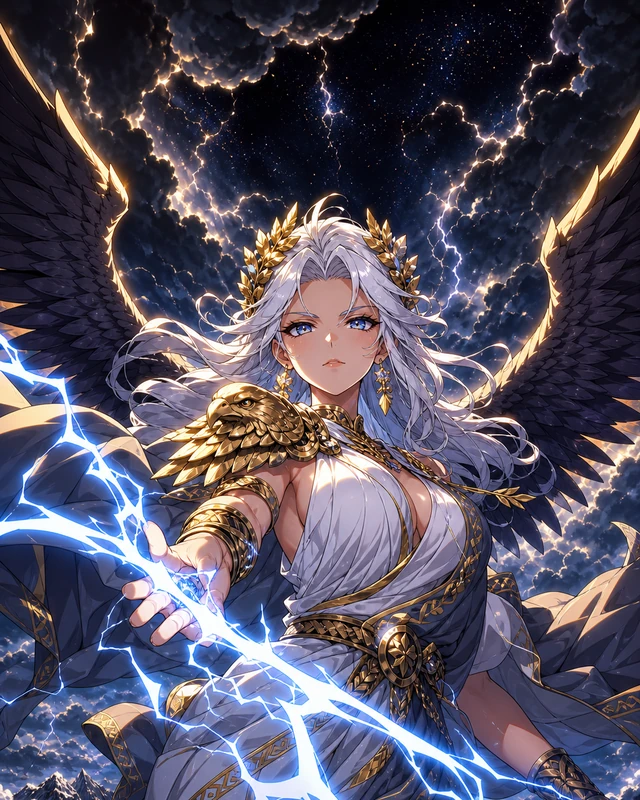

<!-- source-of-truth: package.json, src/config/rules.ts, src/data/cards/*.ts, src/data/starterDecks.ts, src/data/opponents.ts, src/scenes/, docs/design-system.md, docs/plan-design-system-alignment.md, docs/rules.md, docs/ai.md, docs/art-pipeline.md, docs/roadmap.md, docs/mobile-lan-plan.md, tests/ · last-verified: 2026-07-31
     If you change those files, update this doc or re-verify the date.
     Writing rules for this file: no em-dashes or en-dashes (use period/comma/colon/semicolon/parentheses; plain hyphens in numeric ranges), no emojis, and avoid formulaic AI prose patterns (no "X is here" openers, no anthropomorphized marketing lines, no rhetorical triads or dramatic reveal colons). Section order: What is Darling Blades, Features, the latest release notes, then everything else. -->

# Darling Blades

*A trading card game where the officers of the Three Kingdoms, the gods of Olympus, and a forest full of Beastkin all end up in the same deck.*

<p align="center">
  
  
  
</p>

<p align="center">
  <a href="https://vantaloomin.github.io/darling-blades/"><b>Play Darling Blades in your browser</b></a>
</p>

**Desktop:** Starting with 1.5.5, every GitHub Release includes a Windows installer.

## What is Darling Blades?

Darling Blades is a single-player trading card game in the style of Magic: the Gathering, specifically the 8th/9th/10th-edition era: five colors of mana, creatures and combat, instants and sorceries resolving off a stack, and the familiar rhythm of curving out and then racing or grinding to a win. If you played that era of Magic, you already know most of the rules.

The cast is what's different. The **1,079 collectible cards across eight sets** share characters from the officers of **Wei**, **Wu**, **Shu**, and **Jin**, the **Greek pantheon**, tribal **Beastkin**, Ragnarök's graveyard faction, Celtic Fae courts, Arthurian knights, Gothic Monsters, Dark Tales storybook figures, Cyberpunk Yokai Nights, and Sands of the Duat. Every card carries finished cel-shaded gacha-anime art; nothing in the shipped game is programmer-art or a placeholder.

You play or skip a short optional tutorial, claim a free starter deck, crack booster packs to build out your collection, and assemble a 40-spell deck and its ten-land Warchest in the deck builder. Then you duel: Practice matches against any tower boss or a plain difficulty, the 22-rung **Avatar Gauntlet** (a ladder of named boss opponents, each running a themed deck, reshuffled daily), or a seat at the **Draft** table to build a fresh 25-spell deck from passed packs against seven AI rivals.

## Features

- **A 1,079-card collectible pool across eight sets.** Base Set, Ragnarök, Celtic Fae, Arthurian Court, Gothic Monsters, Dark Tales, Cyberpunk Yokai Nights, and Sands of the Duat cover all five WUBRG colors and the same five rarity tiers. Cyberpunk Yokai Nights adds 120 cards built around Hauntlink, while Sands of the Duat adds 245 cards built around Rite, Nine Lives, and Preserve; both have their own set-scoped booster. Dark Tales carries a 60-card companion wave that reprises Nine Lives, Preserve, and Empower.
- **Five starter decks**, one two-color archetype per color pair: **Crimson Muster** (Red/White aggro), **Wild Communion** (Green/White creature tribal), **Burning Tides** (Blue/Red tempo-burn), **Shadow Mandate** (Blue/Black control), and **Grave Harvest** (Black/Green deathblade attrition). Every color shows up in exactly two of the five, and each arrives as 40 spells plus its own ten-land Warchest.
- **Real MTG-style deckbuilding rules**, with one deliberate departure: your lands live in a **Warchest** rather than your deck. A constructed deck is exactly 40 spells built from your own collection plus a ten-land Warchest (at most 5 duals), up to 4 copies of any non-basic card, 20 starting life, a 5-card opening hand, a London-style mulligan with your first mulligan free, and an auto-tap mana solver so you're never manually tapping individual lands to pay generic costs.
- **Two formats.** **Warchest** is the standard constructed format above. **Darlings** is the EDH-style one: your Darling waits in her own zone while you build a 79-card singleton spell deck and a ten-land Warchest, each fall adds 2 to her next call, and paying 4 eases that tax by 2. Five ready-to-play Darlings decks are in the Shop, one of them a free one-time claim, and a dedicated tutorial teaches the format.
- **Gacha-style booster packs.** 450 gold buys 9 cards in the Base Set booster; 525 gold buys 9 in the Ragnarök, Celtic Fae, Arthurian Court, Gothic Monsters, Dark Tales, Cyberpunk Yokai Nights, or Sands of the Duat boosters. Every slot independently rolls a rarity tier, a cosmetic frame (white/blue/red/gold/rainbow/black), a holo finish (none/shiny/rainbow/pearlescent/fractal/void), and a 0.25% Full Art chance where the illustration covers the whole card face. The rarest possible pull (Ultra Rare, black frame, void holo, Full Art) lands at roughly 1 in 1.98 billion. Each pack tile shows how many of its set's cards you already own; its info glyph opens a pool summary alongside the rarity, frame, and holo odds, which are identical across every booster.
- **Every expansion brings its own mechanics.** Ragnarök plays with double strike, mill, and reanimation; Celtic Fae introduced **Sever** (exile-flavored removal) and **Foresee** (top-of-deck smoothing); Arthurian Court added **Quests** that advance a chapter at each of your dawns and **Champion Awakening** transforms; Gothic Monsters brought **Dreaded** attackers that must be blocked by two or none and **Empower** kicker costs; Dark Tales added **Skim** (instant-speed hand smoothing) and **Retell** (recast a Ritual or Charm from the graveyard, then sever it); Yokai Nights brought **Hauntlink**; and Sands of the Duat adds **Rite** (sacrifice as an additional cost), **Nine Lives** (return once with a +1/+1 mark), and **Preserve** (token copy from the graveyard). Everything is engine-first and seeded-deterministic, with player-facing duel affordances.
- **The Avatar Gauntlet**: a 22-rung, 22-floor ladder of named boss opponents (Meng Huo, Hestia, Lupa the Wolfqueen, Hera, Zhurong, Sima Yi, Yohime the Kitsune Matriarch, Cao Cao, the Ragnarök bosses Hel and Brunhild, the Celtic Fae pair of The Morrigan and Titania, the Arthurian summit of Morgan of the Thorn Crown and Artoria, Once and Future Queen, the Gothic Monsters pair of Carmilla and The Bride, the Dark Tales pair of Glass-Coffin Queen and Abyssal Songstress, the Yokai Nights pair of Queen of the Lanterned Roof and Kitsune Neon Tyrant, and the Sands of the Duat pair of Anubis, Who Holds the Scale and Bastet, Mistress of the Ninth Return), each piloting a themed deck and personality. The roster reshuffles every day from a date seed, and the floor you reach sets the AI's strength on a six-tier ladder while the avatar brings its own deck and personality. Gold pays out per rung cleared plus a bonus for a full run. Practice mode lets you challenge any of the 22 bosses directly, or a plain difficulty, with no ladder attached.
- **Draft mode**: the eight-seat persona draft described in the release notes below, with a free tier that pays gold on your record and a Premium tier that keeps its picks.
- **Optional onboarding and long-term goals.** First launch offers a guided tutorial duel, and the Achievements screen tracks collection percentage, color completion, themed RoTK / Greek / Beastkin / Ragnarök goals, mono/dual-color tower clears, variant chase goals, mastery goals, and pack-opening milestones with claimable gold rewards.
- **Daily Blades**: three rotating daily quests with progress bars, claimable gold, and up to three rerolls a day, plus an escalating win-streak bonus paid on your first win of each calendar day. The same calendar day rolls the same quests for everyone, because the quest roll is deterministically seeded like everything else here.
- **Deck sharing, save codes, and multiple saved decks.** Keep as many constructed decks as you like (copy / rename / delete, plus a starrable per-deck hero card that fronts your in-duel portrait), and export any legal deck as a compact `DBD2-…` share code that another player can paste straight into their own Deck Builder; imports validate against their collection and the normal deckbuilding rules. The Profile page can also export your entire profile as a save code and import one on another machine, with replays optional.
- **Deterministic replays.** The game records your last ten duels (seed, decks, and every action) and replays them from the Profile reel with play, pause, step, and speed controls. A replay is a byte-exact re-simulation, not a video.
- **AI that never cheats.** Every difficulty (Easy, Medium, Hard) plays through the exact same redacted view of the game state a human opponent would see; none of them can look at your hand or either deck's remaining contents. The difficulty gap is measured rather than assumed: Medium beats Easy at least 80% of the time (measured around 82.5%) and Hard beats Medium at least 70% of the time (measured around 78%) across large seeded AI-vs-AI test batches.
- **Fully illustrated, nothing placeholder.** All 1,079 collectible cards across eight sets carry finished cel-shaded gacha-anime art, plus painted backdrops for every scene and pack art for every set. Every card image ships as WebP; the art payload is 200.91 MiB, of which 162.20 MiB is card art. Basic lands come in per-set landscape styles you choose in the deck builder. The audio side is entirely procedural: every sound effect and the four-mood generative ambient music score are synthesized live in the browser over WebAudio, with no audio asset files at all.
- **Built-in accessibility settings**: independent SFX and music toggles with volume control, an animation-level switch (full / reduced / off), a render-size selector (720p / 1080p / 1440p), and an auto-skip toggle that fast-forwards empty or forced duel phases. Every setting persists to your save.
- **Playable on your phone today.** The entire single-player loop runs comfortably by touch over your local network. Real head-to-head LAN multiplayer is designed but not yet built; see Project status below.

## What's new in 1.6

**Warchest is now the mana system, everywhere.** Your lands no longer sit in
your deck. Every deck is 40 spells plus a ten-land Warchest, you open on five
cards, and you move one land from Reserves into your Active Warchest each turn.
Classic constructed has retired. Decks you already built are kept, marked, and
routed to a repair flow that fixes them in a couple of clicks, and untouched
starter decks convert themselves.

**Sands of the Duat, a 245-card expansion.** The largest set yet, built
reserve-native from the first sketch, on three mechanics. **Rite** casts a card
by sacrificing creatures you control as an extra cost, and the sacrificed
creatures die first, so their own death triggers still pay you. **Nine Lives**
returns a creature to the battlefield once, the first time it dies, as a fresh
body carrying a mark. **Preserve** works from your graveyard: pay the Preserve
cost to Sever the card and create a token copy of it. The set carries its own
booster, precon, achievements, and set icon.

**Two new bosses and a 22-rung tower.** Anubis, Who Holds the Scale, takes rung
21, and Bastet, Mistress of the Ninth Return, is the final rung 22.

**A 60-card Dark Tales companion wave.** Nine Lives, Preserve, and Empower
return to the storybook set, and two ultra rares join its headliners.

**Card backs and playmats.** Cosmetics are account-level, unlock outside the
economy, and follow you into pack opening and the duel table.

**Premium presentation.** A multi-pack open is now one continuous rail of every
pull in ascending rarity, with a full stop and a spotlight on an ultra rare.
The mulligan is a real ritual with a riffle and drag-to-bottom staging. Casting
lifts the card and lets you carry it to the field, and taking a land out of
Reserves fans the kinds you can play instead of opening a modal. The
Achievements screen is a five-wing hall, and you can pin three trophies to your
Profile.

**A tutorial that teaches the game you actually play.** The opening lesson is
the Warchest itself, followed by taking your first land out of Reserves.

## How to play

The main menu routes to:

| Mode | What it does |
| --- | --- |
| **Play → Avatar Gauntlet** | Climb the 22-rung, 22-floor ladder of named boss opponents, reshuffled daily with floor-scaled difficulty; clear a rung and roll straight into the next, with per-rung gold and a completion bonus. |
| **Play → Draft** | An eight-seat draft against seven named AI drafters: pick 45 cards across three passed packs, build a 40-card deck, and play three matches. Free entry pays gold on your record; Premium (1,000g, twice a week) keeps every pick. |
| **Play → Practice** | A one-off duel with no ladder attached: pick any of the 22 tower bosses (with their deck and personality) or a plain Easy / Medium / Hard opponent. |
| **Shop** | Buy a 9-card booster (Base Set, Ragnarök, Celtic Fae, Arthurian Court, Gothic Monsters, Dark Tales, Cyberpunk Yokai Nights, or Sands of the Duat) and watch the rarity/frame/holo reveal animate slot by slot, or buy whole decks (the unpicked starters and the expansion precons) from the Decks tab, each with a full-stats preview. Every booster carries an info glyph with that set's exact drop rates. |
| **Collection** | A binder-style spread of every card you own, filterable by color / type / rarity / set / owned, showing your best-owned print of each plus pool and special-variant completion progress, with a Craft action on any card you're missing. |
| **Decks** | Pick your active deck, and build or edit your decks and Warchests from your owned collection. |
| **Achievements** | Review locked/unlocked/claimed goals and claim gold rewards for collection, variant, themed, mastery, and economy milestones. |
| **Card Showcase** | A gallery of every frame style and holo finish available on a given card. |

The main menu also hosts the **Daily Blades** quest panel and a **Profile** page with your lifetime win-rate, gauntlet stats, and the **Replays** reel: rewatch any of your last ten duels with play, pause, step, and speed controls. On first launch you can play or skip the tutorial, then claim one free starter deck from the shop and receive a starting gold grant, enough for your first booster pack. The Settings button opens the accessibility/audio options described above.

## Getting started

```bash
npm install
npm run dev      # Vite dev server at :5173
npm run build    # typecheck + production build
npx vitest run    # full test suite (~8 min; AI win-rate gates included)
```

On Windows you can also double-click **`run-dev.bat`** or **`run-production.bat`**; both install dependencies if missing.

## Under the hood

Darling Blades is TypeScript on Vite, rendered with Phaser 3.90 (pinned; never v4), tested with Vitest, and linted with ESLint/typescript-eslint. There's no UI framework underneath the game view; it's Phaser end to end.

The codebase is split into two halves that never touch each other's concerns. `src/engine/` is a pure, Phaser-free, deterministic rules engine: given a set of decklists, a seed, and a sequence of player actions, it produces the exact same game state and event stream on every machine, every time. State is plain JSON, so a `structuredClone` is the entire "save/replay" story, and even the RNG lives inside that state as data. A single facade validates and applies every action and emits events; the Phaser scenes (`src/scenes/`) only ever consume that event stream to animate, and hold no rules logic of their own. The AI (`src/ai/`) plays through that same engine via the identical redacted view a human sees, which is what makes the "no AI reads hidden information" guarantee structural instead of a promise in a comment.

That separation is what makes a real test suite possible: **1,277 tests (4 skipped) across 134 files**, covering engine flow/combat/keywords/mana/RNG/determinism, the stack and effects, catalog integrity, meta systems (collection, economy, save migrations, gauntlet, achievements, daily quests, Limited drafting, deck share codes, deck color identity), the variant/drop-distribution math behind the booster system, economy EV gates and named exploit regressions backed by a 10-persona progression simulator, onboarding tutorial determinism, audio recipes and music patterns, platform/gesture/render-scale behavior, and AI smoke tests plus the win-rate gates above (hundreds of full AI-vs-AI games). The whole suite finishes in about eight minutes on the release-prep Windows host.

For deeper dives: [docs/architecture.md](docs/architecture.md) (layers, the event/decision model, determinism), [docs/design-system.md](docs/design-system.md) (visual language, tokens, components, and interaction contracts), [docs/plan-design-system-alignment.md](docs/plan-design-system-alignment.md) (the audited implementation sequence required for full alignment), [docs/rules.md](docs/rules.md) (the full ruleset as implemented), [docs/adding-cards.md](docs/adding-cards.md) (the card schema and how new cards get built), [docs/ai.md](docs/ai.md) (how each difficulty thinks), [docs/art-pipeline.md](docs/art-pipeline.md) (the art resolution and generation pipeline), and [docs/roadmap.md](docs/roadmap.md) (current status in detail).

## Project status

**Darling Blades is 1.6.0**, released 2026-08-23 (tag v1.6.0). The full solo loop (menu → optional tutorial → free starter claim → Gauntlet, Draft, or Practice → daily quests and rewards → shop → pack opening → collection / achievements → deck builder) is wired end to end, all 1,079 collectible cards have finished illustrated art, the 22-rung tower is measured against win-rate floors, and the test suite is green.

**Coming after 1.6:** collection pacing gets a second look now that the pool has grown past a thousand cards, and Draft's reserve-native design is the next large open question. Suggested decks, a cinematic replay director, Story Mode, later expansions, player-made card packs, and real head-to-head LAN multiplayer remain further out.

## About this project

This is a personal, single-player project built and tuned by one developer; there's no multiplayer server and no public contribution pipeline at the moment. The codebase does hold itself to a few unusual disciplines for a solo project, though: the rules engine is fully headless and seeded-deterministic, every difficulty of AI is held to a measured (not assumed) win-rate floor, and the documentation in `docs/` carries anti-rot tooling (`npm run check-docs`) that flags a doc as stale the moment the code it describes changes without it.

## License

The source code in this repository is released under the [MIT License](LICENSE).

The illustrated card and scene art (everything under `public/assets/art/`) and the desktop app icons (`src-tauri/icons/`) are **not** covered by that license; all rights to those images are reserved.
